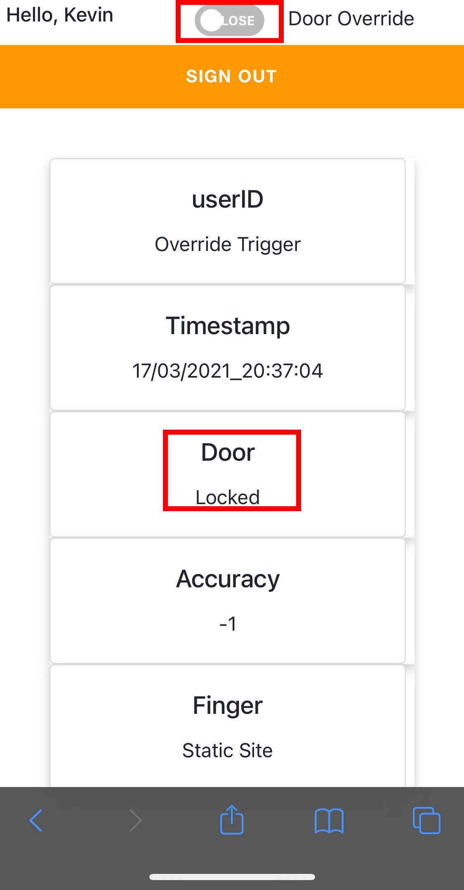
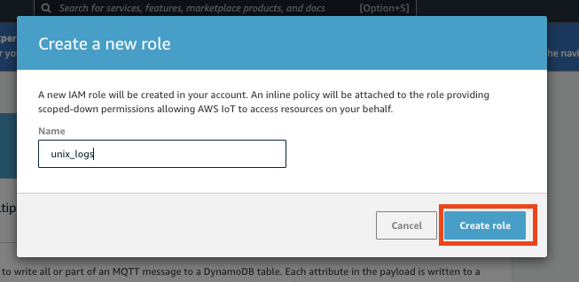
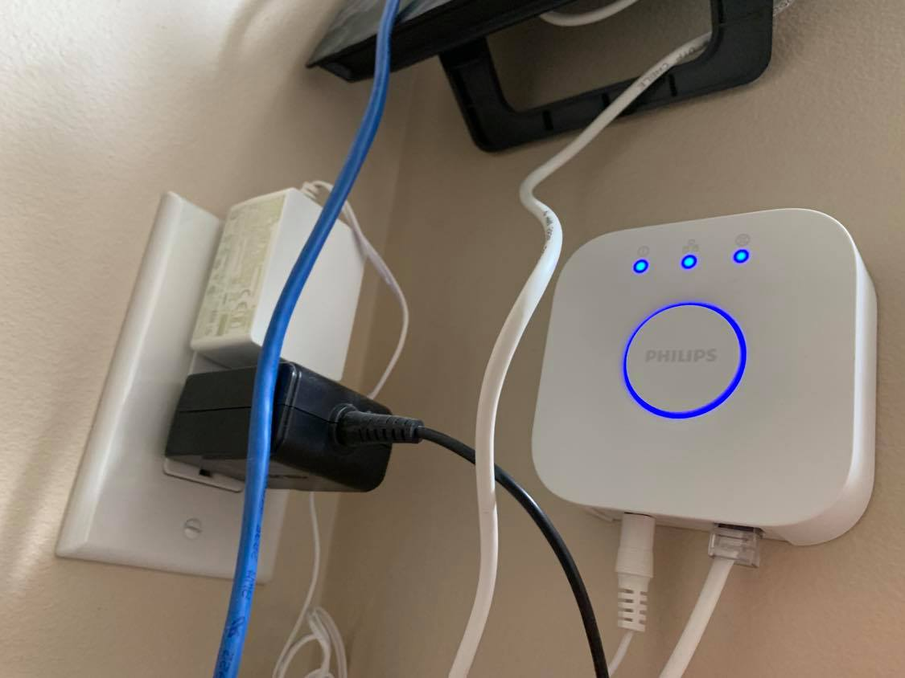

# Smart-Doorlock Documentation

## Summary
Due to COVID-19, in early spring my internship was forced to transition into a remote and virtual experience. Whenever I had a meeting, my housemates would find ways to disturb me, whether by knocking loudly, or by walking in unannounced. I searched everywhere for a smartlock that would be able to alert people outside that I was in a meeting. Unfortunately, I could not find anything that fit all my needs. Fortunately, being the engineering student I am, I knew what I had to do. It was time to bring this idea into existince and build it myself. 

<!--- ! This is the scanning picture [Project_Image](https://github.com/KevyVo/Smart-Doorlock/blob/table/Images/finger.jpg) -->


## Table of Contents

1. [Demo/Features](https://github.com/KevyVo/Smart-Doorlock#demofeatures)
2. [Installation/Instructions](https://github.com/KevyVo/Smart-Doorlock#installationinstructions)
3. [Cloud Architecture](https://github.com/KevyVo/Smart-Doorlock#cloud-architecture)
4. [Embedded Software](https://github.com/KevyVo/Smart-Doorlock#embedded-software)
   1. [High-Level State Diagram](https://github.com/KevyVo/Smart-Doorlock#high-level-state-diagram)
   2. [Low-Level Flowchart](https://github.com/KevyVo/Smart-Doorlock#low-level-flowchart)
   3. [User Table Interaction Diagram](https://github.com/KevyVo/Smart-Doorlock#user-table-interaction-diagram)
   4. [File Struture Directory](https://github.com/KevyVo/Smart-Doorlock#file-struture-directory)
   5. [Custom Librarys](https://github.com/KevyVo/Smart-Doorlock#custom-librarys)
5. [3D Printed Parts and CAD Model](https://github.com/KevyVo/Smart-Doorlock#3d-printed-parts-and-cad-model)
   1. [Front I/O](https://github.com/KevyVo/Smart-Doorlock#3d-printed-parts-and-cad-model)
   2. [Internal Housing](https://github.com/KevyVo/Smart-Doorlock#internal-housing)
6. [Electrical](https://github.com/KevyVo/Smart-Doorlock#electrical-1)
   1. [Wiring Diagram](https://github.com/KevyVo/Smart-Doorlock#wiring-diagram)
   2. [Wiring Tables](https://github.com/KevyVo/Smart-Doorlock#wiring-tables)
7. [Materials and Equipment](https://github.com/KevyVo/Smart-Doorlock#materials-and-equipment)
   1. [Equipment](https://github.com/KevyVo/Smart-Doorlock#equipment)
   2. [Materials](https://github.com/KevyVo/Smart-Doorlock#materials)
8. [Troubleshooting and Common Problems](https://github.com/KevyVo/Smart-Doorlock#troubleshooting-and-common-problems)

## Demo/Features

My work from home security system, aid in alot more ways then just a smart door lock. There would be a live gif and a small explantion for all features:

1.  Remote Arming/Disarming from serverless site</br><details> 
     <summary>Click for Live Demo</summary>
     
     ### Override Trigger
     1. In the gif the main.py file is waiting for a trigger when the user want to diable the alarm system.
        - 
     2. In the gif the main.py file is waiting for a trigger when the user want to arm the alarm system.
        - 
   </details>

2.  Live updates from serverless site</br><details> 
     <summary>Click for Live Demo</summary>
     
     ### Live update
     - Will update all information relating to the last or cuurent state of the door, either by moblie browser or web browser.
       - 
       - 
   </details>

3.  Google calendar API</br><details> 
     <summary>Click for Live Demo</summary>
     
     ### Google Calendar
     - This will read continously from your google work calendar and alert other outside your door not to distrub during these hours.
       - 
   </details>

4.  Autonomous Motion Light/System Sensor</br><details> 
     <summary>Click for Live Demo</summary>
     
     ### Light/System Sensor
     - The light and security system will turn on with motion and turn off after 5 mins of no activity. The sensor will work in the darkest condtions.
       - 
   </details>

5.  Biometric Authentication</br><details> 
     <summary>Click for Live Demo</summary>
     
     ### Fingerprint Scanner
     - Authenticate authorize user to gain access to the room with their pre-regsiter fingerprint, the light will also blink a certain colour depending on the assessment. It will also save any fail fingerprint on local storage for identifying potential unauthorized events.
       - Correct Fingerprint (Blink Green)
       - 
       - Incorrect Fingerprint (Blink Red)
       - 
   </details>

6.  Excceded Timeout</br><details> 
     <summary>Click for Live Demo</summary>
     
     ### Timeout
     - Will set a timeout of 5 mins after 3 continous authenication failures, every addtion failure will be (timeout= tries * 5 mins). This will reset after one correct authernication. It will also save any fail fingerprint on local storage for identifying potential unauthorized events.
       - 
   </details>

7.  Forced Entry Detection</br><details> 
     <summary>Click for Live Demo</summary>
     
     ### Forced Entry Detection
     - Will sound an alarm once the door is open with any proper autheication or break in. The alarm will only turn off once a authenticated fingerprint has reset the alarm.
       - 
   </details>

8.  E-mail alerts</br><details> 
     <summary>Click for Live Demo</summary>
     
     ### Alerts
     - There are 3 events that will send e-mails on
      1. Force Entry Dectection Triggered
          + 
      2. Correct fingerprint to deactivate the alarm
          + 
      3. Fail fingerprint with the fail printed attached to e-mail (In real e-mail the fingerprint would not be blurred)
          + 
   </details>

9.  Logging events into database</br><details> 
     <summary>Click for Live Demo</summary>
     
     ### Logging
     - Will recored all events of the state of the door in a database for security purposes.
       - 
   </details>

10.  Motion alert</br><details> 
     <summary>Click for Live Demo</summary>
     
     ### Logging
     - Red and Green light will blink simultaneously if there is motion on the other side of the door.
       - 
   </details>

11.  Daytime/Nightime Mode</br><details> 
     <summary>Click for Live Demo</summary>
     
     ### Sound Change
     1.  8AM - 8PM the alarm buzzer will make sound when in use
     2.  8PM - 8AM the alarm buzzer will be disable for nightime use
         - 
   </details>

## Installation/Instructions

**Youtube video**
Coming Soon
<!--- [](http://www.youtube.com/watch?v=YOUTUBE_VIDEO_ID_HERE) -->

Since this project is made up of cloud, electrical and software engineering. I have split up instructions into their own categories to make it easier to follow. 
The React static site has it own seprate repo(link), which will appear again in the step below when needed.

Please follow these sequence of instructions in **order** by clicking on the collapsable tabs:</br> **Click on any pictures/GIFs to enlarge them**

1.  <details>
     <summary>Click for General Setup Instruction</summary>
     
     ### General Setup
     1. Gather the materials and make sure you have aquired or have access to the required equipment, found [here](https://github.com/KevyVo/Smart-Doorlock#materials-and-equipment)
     2. Start the 3D print of the Front and Back IO, these prints will take about 1-2 days to 3D print, click here for [files](https://github.com/KevyVo/Smart-Doorlock/tree/master/Cad)
        + There should be 4 total seprate prints
        + These prints will take 1-2 days depending if you deviate from the recommended print settings
        + If you use prusasilcer like me, I highly recommend using these settings here
        + You can find the files here 
     3. Setup the Raspberry Pi
        + RECONMEND: I would use remote access methods like VNC Viewer or SSH, it makes it much easier to control the pi instead of direct connection
        1. Please follow this setup tutorial [here](https://www.tomshardware.com/reviews/raspberry-pi-headless-setup-how-to,6028.html), once completed move onto step b
        2. Please clone this repo to the pi <br/>```git clone https://github.com/KevyVo/Smart-Doorlock ```
        3. cd into the the requirements folder<br/> ```cd Smart-Doorlock/requirments/```
        4. Install the requirements<br/> ```pip install -r require2.txt -r require3.txt```
           + You can also do this inside a virtual environment(venv) if you want
     4. Move onto the Electrical Instructions
   </details>
        &nbsp;&nbsp;&nbsp; 

2.  <details>
     <summary>Click for Electrical Instruction</summary>

     ### Electrical

     For a larger image of the wiring diagram and wiring table, please click [here](https://github.com/KevyVo/Smart-Doorlock#electrical-1)

     1. I would recomend testing all of your components indivdially first to see if there are any defects/problems
        1. Go to the Test directory
        2. Select desired component base on the python file
        3. Follow the comment instrutions in the py file of what gpio pins to connect to
        + If the python file does not run in the ide, run it in the terminal using python3 command</br> ```python3 component_name.py```
        + By doing this you will understand how each component behaves and interacts with each other, and assures that it is free of defect
     2. cd into the ```cd Smart-Doorlock/Components/pyfingerprint/example_enroll```
        + I am still working on a feature to enroll your fingerprint using a button on the static- please stay posted! For now, use this method, unless you want to help the project add to it :)
     3. Run the file either in the terminal or ide
        + Congrats! Your fingerprint has been enrolled locally to the system
     4. When connecting the dupoint connectors, make sure you can disconnect the male to female cable apart. This will be useful for mounting installtion later.
        + 
        + 
     5. Label all cables like this; it make the rewiring installtion easier later on
        + 
     6. Connect and solder all the electical connections using this diagram and connection tables found here
        + RECOMMENDED: I personally connect all the connections and components on a protyping breadboard before moving onto the solderable PCB
        + 
        + Run the script ```non-cloud base script```
     7. Run the non cloud base script, to test how all the components will work all together
        + If you see any warnings that do not effect your program, just ignore them for now
     8. If everything was successful please move onto Cloud instructions 
   </details>

   &nbsp;&nbsp;&nbsp; 

3.  <details>
     <summary>Click for Cloud/Software Instruction</summary>

     If you want to read more about how the cloud architecture works please click [here](https://github.com/KevyVo/Smart-Doorlock#cloud-architecture)

     If you want to read more about the flow of the software, please click [here](https://github.com/KevyVo/Smart-Doorlock#embedded-software)

     ### AWS Setup
      1. Sign up for a AWS account (if you already have a account you can skip this step)
         + Follow this [guide](https://docs.aws.amazon.com/polly/latest/dg/setting-up.html) for help if needed 
         + AWS is free if you stay below the free teir limit (we won`t even get close to hitting the limit in this project); AWS is also cheap for personal use if you go over the limit. 
      2. Setup a new IAM user- make sure to give programmatic access and console access and AdministratorAccess policy (you can add the appropriate policy if you know what you are doing)
         + 
         + 
      3. Retrieve the credential for later use
      4. Open up the terminal on the Pi and enter:</br>```aws configure```
      5. Enter that AWS account credentional; please refer to the screenshot for futher assitance and [link](https://docs.aws.amazon.com/polly/latest/dg/setup-aws-cli.html)
         + 
     ### AWS Iot Core (PubSub)
      1.  We need to sign into the aws console and go to AWS Iot core
      2.  Go to Manage->Things->Regsister a thing
          + 
      3.  Click create a single thing and Give your thing name, scroll down and tap on the Next button and then you are immediately offered the one-click certificate generation option. An individual X.509 certificate per device is the recommended way of interacting with AWS IoT services from devices, offering the ability to burn the private key into the device upon enrolment that is then never transferred across the internet alongside requests, a security win. Download the certificate and private key for each device, and also a root CA. Make sure to hit that activate button so the certificate can be used. finish the process by clicking on the “Done” button.
          + 
          + 
          + 
      4.  Next point is to create and attach a policy to the certificate, authorizing the authenticated device to perform IoT actions on IoT resources. for this tap on the “secure” tab from the AWS IoT menu which is on the left side, later go for the policies section. Now tap on the button named “Create” which is on the top right corner beside the iot-notifications Icon. give your policy name and fill the fields(Action, Resource ARN ) with a star “*” and check to Allow for Effect option then press the “create” button.
      5.  Now tap on the certificates section which is right above the policies section, You will see a certificate which you have created earlier, tap on the three dots and choose to attach the policy, a pop will come showing your existing policies, check on the recent policy that you have created and attach. That’s it you have successfully created a thing, generated a certificate and attached policy to it.
      6.  You can find the endpoint here
          + 
      7.  I recommend putting all the files/cerficates in the empty directory I premade called "Credtionals"
          + The endpoint can found here
      8.  Fill out the appropriate lines out with the correct pathing in the main.py</br>
            ```
            awshost = "xxxxxxxxxxxxxx-ats.iot.us-east-2.amazonaws.com" # Endpoint
            awsport = 8883 # Port no. 
            clientId = "xxxxxxxx" # Thing_Name
            thingName = "xxxxxxxxxx" # Thing_Name
            caPath = "/home/pi/xxxxxxxx/xxxxxxxx.pem" # Root_CA_Certificate_Name
            certPath = "/home/pi/xxxxxxxx/xxxxxxxx-certificate.pem.crt" # <Thing_Name>.cert.pem
            keyPath = "/home/pi/xxxxxxxx/xxxxxxxx-private.pem.key" # <Thing_Name>.private.key
            ```
      9.  We can test the if the pubsub is working using this script ```python only-pubsub.py```
      10. You should be able to see a Message sent on the ide or terminal when you scan your fingerprint or change the state of the door
          + 
      11. You can see the data be pushed to AWS Iot core buy going to AWS Iot Core->Test
          1.  Subcribe to topic(it the thingname filled out above)
          2.  Everything can be default
          3.  Hit Subscribe to topic
          4.  You should see a message send like this on your browser
             + 
     ### User Table interaction
     This diagram shows how the User table interacts with the main python script; to learn more about it click [here](https://github.com/KevyVo/Smart-Doorlock#user-table-interaction-diagram)</br>
      
      - We are going to build this table in the following step
     ### AWS Dynamodb (Database)
      1. Navigate to AWS Dynamodb and make a new Table label: User
         + 
         + This will be the user database, for now you either have to setup the user using the python script or manually using these fields, I am working on add user using the react site on a future feature.
      2. Fill out the parameter of the table like this
          +  
          +  Make a diagram of how the user and the fingerprint and the main.py interact with each other
      3. Navgaite to AWS Iot Core->Act and Click on Create a rule
         + 
      4. Enter ```real-time-door``` for Name
         + 
      5. Under Rule query statement, choose the latest version from the Using SQL version list.</br>For Rule query statement, enter: ```SELECT * FROM `Smart_Lock` ```
         + 
      6. Click add Action
         + 
      7. On Select an action, choose to Insert a message into a DynamoDB table and then choose Configure action.
          + 
      8.  On Configure action, choose to create a new resource.
          + 
      9.  On the Amazon DynamoDB page, choose Create table.
      10. When creating the DynamoDB table, enter ```Users``` for table name. In Partition key, enter ```date```. Select Add sort key, and then enter ```unix``` in the Sort key field. Choose String for date (partition Key) and choose Number for unix (sort key) and then check Use Default settings.Now choose to Create as marked in the below screenshot.
          +  I would reccommend follow what I put exactly unless you know what you are doing because my script will being look for these exact key names
          +  
      11. It takes a few seconds to create your DynamoDB table. Close the browser tab where the Amazon DynamoDB console is open. If you don’t close the tab, your DynamoDB table is not displayed in the Table name list on the Configure action page of the AWS IoT console.
      12. On Configure action, First of all, refresh the resources by clicking on the refresh sign between the Table name drop down and Create a new resource button. Then choose your new table from the Table name list.
          + 
      13. In Create a new role, enter a unique name, and then choose to Create role.
          + 
      14. Choose Add action
      15. Choose Create rule.
      16. After the successful creation of the rule, you will see the following screenshot.
          + 
      17. To see if your AWS Iot Core has logged your events, you can go to AWS Dynamodb and click on the table you just created
      18. Click on items and you will see your last couple of messages that was sent from your pi
          + 

      ### E-mail alert
     **For right now this only work with G-mail account**
      1. Navigate to the file cred/e-mail.txt
      2. Fill out your credtional in the format of the placeholder  and save the text file (This will be the sender e-mail)
      3. Go to the main.py and replace the placeholder of the receving e-mail
      4. If this section was successful you shoud recieve e-mail only for 3 events
         1. Force Entry Dectection Triggered
             + 
         2. Correct fingerprint to deactivate the alarm
             + 
         3. Fail fingerprint with the fail printed attached to e-mail (In real e-mail the fingerprint would not be blurred)
             + 
   </details>
      &nbsp;&nbsp;&nbsp; 
   

4.  <details>
     <summary>Click for Static Site Instruction</summary>
     
     ### Static Site
     Insert the website only side of the cloud digram here
     1. Since the static repo had to be a different repo, I have tranfer the instruction for portion onto the static repo, insert link here
     2. Please return here after completion of the static site repo
     3. Congrats! If everything works, the only thing we still need to do is mount it onto our door. Move onto the Mounting instrutions
   </details>
        &nbsp;&nbsp;&nbsp; 

5.  <details>
     <summary>Click for Smart Lights Instruction</summary>
     
     ### Smart Light Control
     As of now, this device is only compatiable with Philips Hue Lights (mention in Material list)
     1. The lights and Hue bridge should be installed normally with the regular instrutions
        +  
     2. You know need to find what is the Hue bridge IP address, there are a couple method on how to find this ip:
        1. Accessing your router using the browser
        2. A windows scanner called [Advanced IP Scanner](https://www.advanced-ip-scanner.com/)
        3. [Nmap](https://www.raspberrypi.org/documentation/remote-access/ip-address.md) scanning
         + 
     3. Make sure that all the lights have recognizeble names on your smartphone app
     4. Call the Hue bridge API by typing this into your browser, URL:</br>```http://<IP>/debug/clip.html``` Use the IP we retrieve above
     5. We need to create user to use the api
        + On the page fill out the parameter like this:</b>
           ```
           URL: /api
           Message Body:
            {"devicetype":"TestApp#RaspberryPi"}
           ```
        +       
      1. Press the Hue bridge button, then in the following 30 seconds hit the POST button to run the query
         + 
      2. A username should now be generated; please record the username somewhere. We will need this information later.
      3. We will now call all the lights to idenify their names; this will ensure that both lights are connecting with the API
        + Fill in the parameter like this:</br>
          ```
          URL: /api/<username>/lights
          (Replace <username> by the one you got in the previous step (long random string))
          ```
      4. Press the GET button
         + On successful response you should see the names of each light 
         +  
      5.  One last test is to turn off one of the lights
         + Fill ther parameter like this:</br>
           ```
           URL:/api/<username>/lights/2/state
           Message Body:
            {"on":false}
           ```
      6.  Press the PUT Button
          + On a successfull call you should see your light switch off
          +  
      7.  Navigate to ```Smart-Doorlock/Classes/lock_lib.py```
      8.  Open the file in a IDE and replace the placeholder #IP Address with the IP of the Hue bridge 
      9.  Save and close the file
      10. Run the python file ```Smart-doorlock/Test/Smartlightmain.py``` in the terminal
      11. Try unlocking and Locking your door using your fingerprint.<br>The light should flash green on successful fingerprint authention and flash red on incorrect fingerprint
          +  
          + 
      12. If the lights work properly with the python file, move on to the Google Calendar Instructions
   </details>
        &nbsp;&nbsp;&nbsp; 

6.  <details>
     <summary>Click for Google Calendar Instruction</summary>
     
     ### Meeting Detection
     1. Sign into your google account, using the same address as the E-mail alart
     2. Navigate to google calendar and make a differnt calendar called Work
     3. Make a Fake meeting from now until four hours from now. 
       + The title has to contain the word Meeting in it and assign to the work calendar
       + 
     4. Click on this [link](https://developers.google.com/calendar/quickstart/python), You only need to do step one of the google guide by clicking the blue button: Enable the Google Calendar API
       + It will create a new Cloud Platform project and automatically enable the Google Calendar API and make a credentionals.json for us to use
       + 
     5. Navigate to the directoty and run Smart-Doorlock/G-Cal/gen_pickle.py
       + A window should appear to sign in and give authentican to this python file, it also geneerate a token for future uses
     6. Now we can run the final script
     7. Open a terminal and Navigate then run the file Smart_Doorlock/Src/main.py
       + I found that it runs smoother in the terminal for long term use
       + 
     8. The IO diplay should also know display a active meeting when motion is detected
       +  
     9.  Congrats! The entire system works now, move onto Mounting instrutions
   </details>
        &nbsp;&nbsp;&nbsp; 

7.  <details>
     <summary>Click for Assembly and Mounting Instruction</summary>
     
     ### Assembly
     1. Insert the all components to the front IO like this
      + 
      + 
     2. Use the hot glue gun to keep everything secure, be careful not to touch the 3d print. The heat will burn/damage the print.
      + 
     3. Attach the PCB to the base plate of the door mount
      + 
     4. Attach all the components to the back of the IO like this
      + 
     5. Drill 3 holes on the cover 
     6. Put the 3 x M3 bolts and nuts to secure cover to the base by using the hinge
      + 
      + 
   
     ### Mounting
     1. Pick a spot where you like the housing to be placed and drill a 1/4 inch hole 
        + 
     2. Mount the Front IO to the door using the 4x10mm serews
        + 
     3.  Mount the reed switch to top of the door
     4. + 
     5.  Connect the reed pin to the pi
     6.  Mount the electromagent to the top of the door 
         + 
     7.  Connect the electromagent to the relay
        + WARNING: be careful using a electromagnet, these magnet can seriously hurt you due to the crushing magnetic attraction force
     8.  Attach the Front mounting base to the other side of door and use a level to ensure that it is straight
         
     9.  Route the wires through the hole and push the cover onto base until flush with the door
         
     10. Reconnect the wires using the labels from earlier
          + 
          + I recommend taping a printed sheet of the GPIO to the door while wiring as a reference. This makes it so much easier.
          + 
     11. Connect the Power to usb c on the pi(For now the power will be deliver from the wall, I am looking to making a long lasting battery solution.)
     12. Close the lid, the magnets will attach onto the metal serews holding onto the door
         
     13. Plug in the electromagent power
     14. VNC or SSH into the pi and run the file ```Smart-doorlock/main.py``` in the terminal
     15. Congrats! You have just join the advanced smart security system club. No more bursting into your room!
   </details>
        &nbsp;&nbsp;&nbsp; 

## Cloud Architecture


The majority of the web services I used is Amazon Web Services(AWS). Here are the reasons I why I used AWS. Firstly, I was the most comfortable using AWS because of my experience working at Amazon with AWS. Secondly, it has the service AWS IOT Core which the other companies do not offer a PubSub system. You can also used AWS SNS too instead of using the STMP server. I did this because using a STMP server would be free instead of paying for each message send by AWS SNS. The fingerprint files are stored on the local drive of the raspberry for security, instead of being uploaded to S3. My current stack of AWS is free, as I was below the 5GB free teir limit. The only thing I had to pay for was my one time website domain, heimdallr.ca.

## Embedded Software 

### High-Level State Diagram

The diagram represent will how the main.py states change depending on the inputs and sensor data.
You can download/enlarge the image by clicking on it.


### Low-Level Flowchart

The flowchart explain every logic decisions in a very low-level.
You can download/enlarge the image by clicking on it.


### User Table Interaction Diagram

<details>
  <summary>Click for explanation</summary>
  
### Explaintion
1. User scan fingerprint on scanner
2. The fingerprint image get converted into a characteristic text buffer file. The file contain the unqie features of every different fingerprint then stores it into this buffer file.
3. The characteristic file now compares itself to the other key characteristic in the local database. Every different fingerprint file has a index slot that corresponds to it characteristic file.
4. If the buffer file matach over 60% similarity to local characteristic file it will go to the AWS Dyanmodb User Table and lookup the corresponding index number. If not match was found, a value of -1 will be return.
5. AWS Dyanmodb Table will now return all the infomation corresponding to the index number back to the main.py to authenicate the user.

</details>

### File Struture Directory
```
Smart-Doorlock
├───cal
│   └───__pycache__
├───Components
│   ├───Cred
│   │   ├───Lock_smart
│   │   └───Override
│   ├───phue
│   ├───pyfingerprint
│   │   ├───doc
│   │   └───src
│   │       ├───debian
│   │       │   └───source
│   │       └───files
│   │           ├───examples
│   │           └───pyfingerprint
│   └───raspberrypi-lcd
├───e-mail
│   └───__pycache__
├───Electrical
│   └───Images
├───Images
│   └───Diagrams
│       ├───Cloud
│       │   ├───Final
│       │   └───Icons
│       ├───FlowChart
│       └───State_Diagram
├───Src
├───table
│   └───.vscode
└───Test
    └───__pycache__
```

### Custom Libraries

I have created these 7 custom libraries to interact with the main.py file as the main driving file.

1. lcd_lib.py
   - Responsibilty: 
     - Provides a class intake a string and convert it to bits to display the string on the LCD
2. lock_lib.py
   - Dependency: 
     - lcd_lib
     - awsIOT_lib
   - Responsibilty: 
     - Handles all of the locking and re-locking logic
     - Handles all the buzzer sounds and lights sequence
     - Send state messages to AWS IOT Core
3. db_lib.py
   - Responsibilty:
     - Checks if the table exist, if no table then create a new table
     - Retrieve information from tables
     - append items
4. awsIOT_lib.py
     - Responsibilty:
       - Connects to the AWS Iot Core
       - Publish MQTT messages
5. awsIOT_sub.py
     - Responsibilty:
       - Connects to the AWS Iot Core
       - Constantly listen to the command sent from React site
6. GCAL_lib.py
      - Responsibilty: 
        - Connects to the Google calendar api
        - Constantly listen to work calendar for event and event changes 
7. mail_lib.py
      - Responsibilty:
        - Connects to SMTP server
        - Send e-mails from lock e-mail to user email

## 3D Printed Parts and CAD Model

### Print Settings

For Prusasilcer my [3mf](https://github.com/KevyVo/Smart-Doorlock/blob/master/Cad/Front_IO/Mk3s/Front_IO.3mf) file has all of the print settings, just set the machine to other models if you are not using a Prusa i3 MK3s</br>


<details>
  <summary>Click for Cura silcer</summary>

  ### Cura
   - Cura Normal profile
   - Nozzle 0.4mm (haven`t tested other nozzles)
   - Infill density: 20%
   - Skirt: 3 layers
   - Support from build plate only
</details>

<details>
  <summary>Click for other silcers</summary>

  ### Other
   - Support from build plate only
   - Nozzle 0.4mm (haven`t tested other nozzles)
   - Infill density: 20%
   - Skirt: 3 layers
   - First layer speed 20mm/s
   - Perimeters: 45mm/s
   - Infill speed: 80mm/s
</details>


### Front I/O

Click [here](https://github.com/KevyVo/Smart-Doorlock/tree/master/Cad/Front_IO) for CAD files</br>

Click [here](https://github.com/KevyVo/Smart-Doorlock/blob/master/Cad/Front_IO/Mk3s/Front_IO.3mf) for 3mf/gcode for Prusa i3 MK3

**Front**


<details>
  <summary>Click for more Photos</summary>
  
**Rear** 


**Waiting for Scan**


**Inside**


**Custom PCB**


**Print**


</details>

---

### Internal Housing

Click [here](https://github.com/KevyVo/Smart-Doorlock/tree/master/Cad/Back) for CAD files</br>

Click [here](https://github.com/KevyVo/Smart-Doorlock/blob/master/Cad/Back/Mk3s/Back.3mf) for 3mf/gcode for Prusa i3 MK3

**Front**


<details><summary>Click for more Photos</summary>
<p>

**CAD Inside**


**CAD Rear**


**Inside**


**Cover**


**Print**


</p>
</details>

## Electrical

### Wiring Diagram

If the image is to small you can click and download the image.
There are also corresposing wiring tables below if the diagram need more clearifcation.


<details>
  <summary>Click for more Photos</summary>
  


</details>

### Wiring Tables
<details>
  <summary>Click for Stand Alone Components Table</summary>

  BB GND = Breadboard Ground</br>
  BB POS = Breadboard Positive</br>
  PIR = Passive Infor read Sensor
  
| **From** | **To** | **Wire Colour** | **Component** |
|:----:|:----:|:----:|:----:|
|#1(3v3)|Fan Pos|Red|Cooling Fan|
|#9(GND)|Fan Neg|Black|Cooling Fan|
|#29(GPIO 5)|Reed Pos|White|Reed Switch|
|#25(GND)|Reed Neg|Black|Reed Switch|
|#4(5V)|PIR Pos|Red|PIR|
|#7(GPIO 4)|Data|Yellow|PIR|
|#14(GND)|PIR Neg|Black|PIR|
|BB GND|LED GND|Black|LCD|
|BB POS|LED Power|Red|LCD|
|#12(GPIO 8)|DB7|Orange|LCD|
|#16(GPIO 23)|DB6|Grey|LCD|
|#18(GPIO 24)|DB5|Brown|LCD|
|#22(GPIO 25)|DB4|Cyan|LCD|
|#10(GPIO 15)|E|White|LCD|
|BB GND|R/W|Black|LCD|
|#28(ID_SC)|RS|Light Brown|LCD|
|BB GND|V0|Black|LCD|
|BB Pos|VDD|Red|LCD|
|BB GND|LCD1|Black|LCD|
|#40(GPIO 21)|Buzzer Pos|Red|Buzzer 1|
|#39(GND)|Buzzer Neg|Black|Buzzer 1|
|#38(GPIO 20)|Buzzer Pos|Red|Buzzer 2|
|#34(GND)|Buzzer Neg|Black|Buzzer 2|
</details>

<details>
  <summary>Click for Resistor Componets Table</summary>

  BB GND = Breadboard Ground</br>
  R = 10K ohms Resistor 
  
| **From** | **To** | **Wire Colour** | **Component** |
|:----:|:----:|:----:|:----:|
|#36(GPIO 16)|Cathode with R|Green|Green LED 1|
|BB GND|Anode|Black|Green LED 1|
|#37(GPIO26)|Cathode with R|Green|Green LED 2|
|BB GND|Anode|Black|Green LED 2|
|#31(GPIO 6)|Cathode with R|Cyan|Pushbutton 1|
|BB(GND)|Anode|Black|Pushbutton 1|
|#33(GPIO 13)|Cathode with R|Yellow|Pushbutton 2|
|BB GND|Anode|Black|Pushbutton 2|
|#35(GPIO 19)|Cathode with R|Pink|Red LED 1|
|BB GND|Anode|Black|Red LED 1|
|#13(GPIO 27)|Cathode with R|Pink|Red Led 2|
|BB GND|Anode|Black|Red LED 2|
</details>

<details>
  <summary>Click for Muti-Components Table</summary>

  There will be a table for each component in this section.

  BB GND = Breadboard Ground</br>
  BB Pos = Breadboard Postive
  
  ### Relay and Electromagent
| **From** | **To** | **Wire Colour** | **Component** |
|:----:|:----:|:----:|:----:|
|#11(GPIO 17)|Relay Data|Blue|Pi-Relay|
|BB Pos|Relay Pos|Red|Pi-Relay|
|BB GND|Relay Neg|Black|Pi-Relay|
|Electromagenet Pos|Middle Relay Slot|Red|Relay-Electromagent|
|Electromagenet Neg|Normally Closed(NC)|Black|Relay=Electromagenet|
---
  ### CP2102 and FPM10A (Serial to Fingerprint Scanner)
| **From** | **To** | **Wire Colour** | **Component** |
|:----:|:----:|:----:|:----:|
|3v3|Positive|Red|CP2102-FPM10A|
|Rx|Rx|Green|CP2102-FPM10A|
|Tx|Tx|Blue|CP2102-FPM10A|
|GND|GND|Black|CP2102-FPM10A|
</details>


## Materials and Equipment

### Equipment

If you do not own a 3D printer, there are many other ways you can gain access to one. 

Here are some possible options:
1. A University or School, most places of education now provide 3D printer for use
2. A community center
3. A friend or a famliy member
4. A maker space
5. A online/local printing service

<details>
  <summary>Click for Equipment list</summary>

  If you like to buy some of these items please consider helping support me by buying them through my affiliate links, they would be the same low price either way you purchase them.

+ [3D Printer](https://shop.prusa3d.com/en/3d-printers/180-original-prusa-i3-mk3s-kit.html) (This is the one I have, not a affiliate link)
+ [Wire Strippers](https://amzn.to/3cOpjAx)
+ [Hot Glue Gun](https://amzn.to/38X5VjR)
+ [Soldering Iron/ Soldering Station](https://amzn.to/3vGZ0Vy)
+ [Needle nose pliers](https://amzn.to/30ZeN3T)
+ [Wire cable cutter](https://amzn.to/3eXYLQ3)
+ M3 hex wrench (Usually comes with machine screws)
+ [Metal Pick](https://amzn.to/3cR56tL) (optional, used for support removal) 
+ [Serewdriver](https://amzn.to/311wsrC)
+ [Power drill](https://amzn.to/38X4iTh)
  + Philips head attachment (from screwdriver)
  + [1/8 inch drill bit](https://amzn.to/3vLtjuu)
  + [1/2 inch hole saw attachment](https://amzn.to/3f19h98)

</details>

---

### Materials

I do recommend in just using old parts from pervious projects or leftover from bulk orders. You can try to also find some from a friend or school as well.

If you like to buy some of these items please consider helping support me by buying them through my affiliate links, they would be the same low price either way you purchase them.

<details>
  <summary>Click for Materials list</summary>

1. [Raspberry Pi 4 or 3B+](https://amzn.to/38TmEo7), any GBs is fine (I recommend pi 4)
2. [CP2104](https://amzn.to/3eXKZwI) USB to UART 
3. A Pack of [Dupoint connectors](https://amzn.to/3cKZMZ0) 
4. A set of [22 gauge wires](https://amzn.to/38ZHdiB) 
5. [3D printing Filament](https://amzn.to/3tCKHzE) (I used PLA)
6. [Red LEDS](https://amzn.to/2ONz9uo) x 2 pieces
7. [Green LEDS](https://amzn.to/2ONz9uo) x 2 pieces 
8. 40mm x 40mm [Fan](https://amzn.to/3cRCXmq) 
9. 1 [Heatsink](https://amzn.to/390brC7)
10. 5V 3A [power supply](https://amzn.to/3eXT1WA) for raspberry pi 4
11. [Electromagnet](https://amzn.to/3tB2BTg)
12. [Reed switch](https://amzn.to/2OSEgcX)
13. [Pushbutton](https://www.adafruit.com/product/1010)
14. [USB type C](https://amzn.to/30WdBhK) for raspberry pi power 
15. [Fingerprint scanner](https://www.aliexpress.com/item/33040809031.html?src=google&albch=shopping&acnt=708-803-3821&isdl=y&slnk=&plac=&mtctp=&albbt=Google_7_shopping&aff_platform=google&aff_short_key=UneMJZVf&&albagn=888888&isSmbAutoCall=false&needSmbHouyi=false&albcp=7989987352&albag=90862527748&trgt=743612850874&crea=en33040809031&netw=u&device=c&albpg=743612850874&albpd=en33040809031&gclid=Cj0KCQjwl9GCBhDvARIsAFunhskQvzgE-7x6wdC-5fyLMXuyLtPinmJf92H3m2lHttFl5_B7MwnPiocaArYoEALw_wcB&gclsrc=aw.ds) (FPM10A)
16. [Solderable prototyping PCB](https://amzn.to/2OSPazp)
17. [1602 LCD](https://amzn.to/2P4pzDj)
18. [PIR sensor](https://amzn.to/31cOPKB)
19. [Passive Buzzers](https://amzn.to/3c3QCI8)
20. [Relay](https://amzn.to/38YKgri)
21. A set of 10K [resistors](https://amzn.to/3cTqP4e)
22. Small [hinge](https://amzn.to/3eUgYy1)
23. 8mmx3mm [magnets](https://amzn.to/3918Nfk) x 2 pieces
24. [Philip Smart Lights](https://amzn.to/3eXXYi3)
25. All the screws sizes and quantity 
    - [M3](https://amzn.to/2Qi4969) x 8mm Socket head x 8 pieces 
    - [7mm washers](https://amzn.to/3cIhA6U) x 4 pieces 
    - [#8](https://amzn.to/2PaIg8g) x 5/8 inches wood screws x 8 pieces 
    - Hinge screws comes with the hinge set 

</details>

## Troubleshooting and Common Problems
 
 blah blah blah
 ur fuked
